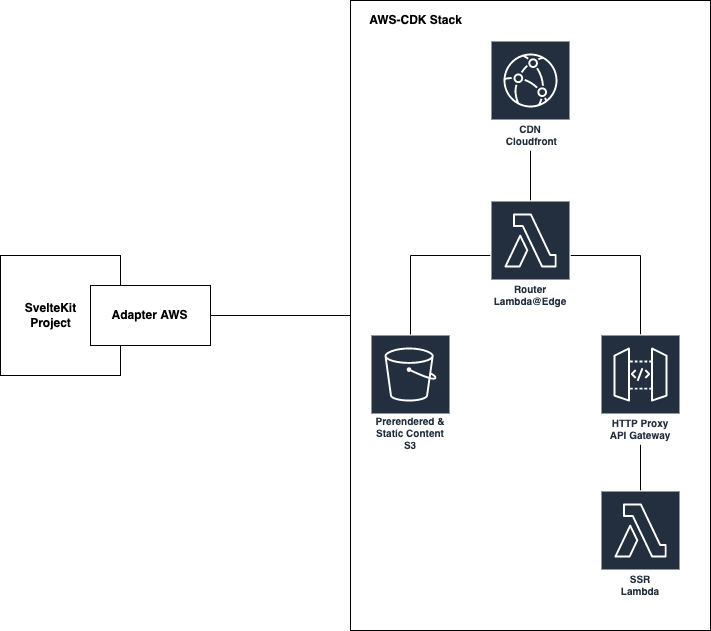

# SvelteKit Adapter AWS

This project contains a SvelteKit adapter to deploy SvelteKit to AWS using AWS-CDK.

## How to use?

1. Create a SvelteKit project "my-app" - `npm create svelte@latest my-app`
2. `cd my-app`
3. `npm install`
4. `npm install -D sveltekit-adapter-aws`
5. edit **svelte.config.js**

## Basic setup example

**svelte.config.js**

```javascript
import { adapter } from 'sveltekit-adapter-aws';
import preprocess from 'svelte-preprocess';

export default {
  preprocess: preprocess(),
  kit: {
    adapter: adapter({
      autoDeploy: true,
    }),
  },
};
```

## Architecture



## Configuration

```typescript
export interface AWSAdapterProps {
  cdkProjectPath?: string; // AWS-CDK App file path for AWS-CDK custom deployment applications (e.g. ${process.cwd()}/deploy.js)
  artifactPath?: string; // Build output directory (default: build)
  autoDeploy?: boolean; // Should automatically deploy in SvelteKit build step (default: false)
  stackName?: string; // AWS-CDK CloudFormation Stackname (default: AWSAdapterStack-Default)
  esbuildOptions?: any; // Override or extend default esbuild options. Supports `external` (default `['node:*']`), `format` (default `cjs`), `target` (default `node16`).
  FQDN?: string; // Full qualified domain name of CloudFront deployment (e.g. demo.example.com)
  MEMORY_SIZE?: number; // Memory size of SSR lambda in MB (default 128 MB)
  LOG_RETENTION_DAYS?: number; // Log retention in days of SSR lambda (default 7 days)
}
```

## Example usages

- [Basic](https://github.com/MikeBild/sveltekit-adapter-aws-basic-example)
- [Advanced](https://github.com/MikeBild/sveltekit-adapter-aws-advanced-example)
- [Full Workshop Example](https://github.com/MikeBild/serverless-workshop-sveltekit)
